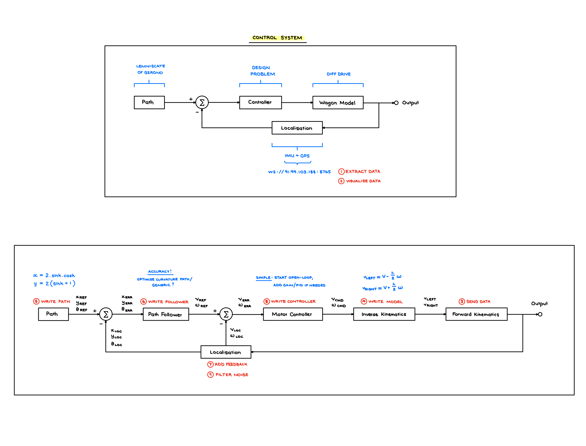

# Approach

## System Overview

This system implements a **four-layer control architecture** for autonomous path following of a differential-drive wagon. The control pipeline processes noisy sensor data (GPS at 1 Hz, IMU at 20 Hz) and generates wheel velocity commands to follow a Lemniscate of Gerono reference path over 20 seconds.



*Figure: Four-layer control architecture*

## Architecture & Components

The control system consists of four hierarchical layers:

### 1. **State Estimation (Localizer)** - `localizer.py`
- **Purpose**: Fuse noisy GPS and IMU data to estimate wagon state (position, heading, velocity)
- **Algorithm**: Complementary filter with bias compensation
  - GPS (1 Hz): Position correction with outlier rejection (2.5m threshold - optimized)
  - IMU (20 Hz): Continuous prediction via accelerometer/gyroscope integration
  - Velocity correction: Proportional feedback (gain=0.45) prevents unbounded drift
- **Key Parameters**:
  - Gyro bias: 0.015 rad/s (estimated from -16.68° drift over 20s stationary phase)
  - Accel X bias: 0.096 m/s² (measured from stationary data)
  - Velocity filter alpha: 0.3 (30% new, 70% old - noise rejection vs responsiveness)
  - GPS outlier threshold: 2.5m (1.25× max inter-update movement at 2 m/s)
- **Known Limitation**: Y-axis accelerometer bias not compensated (assumed negligible for differential drive)

### 2. **Path Following (Pure Pursuit)** - `follower.py`
- **Purpose**: Generate desired velocity commands to track the reference trajectory
- **Algorithm**: Time-based Pure Pursuit with adaptive lookahead
  - Tracks reference point based on elapsed time (ensures 20s completion)
  - Lookahead distance adapts to velocity: `L = 0.9 * |v| + 0.3` (clamped to [0.5m, 2.0m])
  - Computes curvature to lookahead point: `κ = 2*sin(α)/L`
- **Key Parameters**:
  - Base lookahead: 0.8m (good preview without cutting corners)
  - Lookahead time: 0.9s (optimized via parameter sweep for smoothest tracking)
  - Min/max lookahead: [0.5m, 2.0m] (stability bounds)

### 3. **Motor Controller (PI Feedback)** - `motor_controller.py`
- **Purpose**: Correct velocity tracking errors from model mismatch and disturbances
- **Algorithm**: PI feedback on linear and angular velocities
  - Proportional term: Immediate error correction
  - Integral term: Eliminates steady-state errors
  - Anti-windup: Clamps integral at ±0.5 to prevent overshoot
- **Key Parameters**:
  - P gains: Kv = Kω = 0.5 (moderate correction, prioritizes stability)
  - I gains: Kiv = 0.05, Kiω = 0.04 (optimized via parameter sweep for best consistency)

### 4. **Inverse Kinematics** - `model.py`
- **Purpose**: Convert (v, ω) commands to individual wheel velocities
- **Algorithm**: Differential drive kinematics with velocity clamping
  - `v_left = v - (L/2)*ω`, `v_right = v + (L/2)*ω`
  - Wheelbase L = 0.5m
  - Clamps to hardware limits: velocity ∈ [-2.0, 2.0] m/s

## Design Trade-Offs

### Complementary Filter vs. Kalman Filter
**Choice**: Complementary filter
**Rationale**:
- **Pro:** Simple, deterministic, no tuning matrices
- **Pro:** Real-time performance (no matrix inversions)
- **Pro:** Sufficient for this application (GPS/IMU fusion well-understood)
- **Con:** Less optimal than Kalman for non-Gaussian noise
- **Con:** Manual bias compensation required

**Impact**: Achieves ~12.45m ± 4.96m mean L2 error with simple implementation. Kalman would provide marginal improvement at significant complexity cost.

### Pure Pursuit vs. Model Predictive Control (MPC)
**Choice**: Pure Pursuit with PI feedback
**Rationale**:
- **Pro:** Geometric intuition (follow carrot on path)
- **Pro:** Fast, no optimization required
- **Pro:** Well-suited for smooth, pre-defined paths
- **Con:** No explicit constraint handling (relies on lookahead tuning)
- **Con:** Less robust to obstacles

**Impact**: Successfully tracks Lemniscate with adaptive lookahead. MPC would enable explicit velocity constraints but requires real-time optimization (overkill for this task).

### PI vs. PID Control
**Choice**: PI feedback (no derivative term)
**Rationale**:
- **Pro:** P-term corrects errors, I-term eliminates steady-state drift
- **Pro:** Derivative amplifies sensor noise (especially with 20 Hz IMU)
- **Pro:** Low-pass velocity filter (α=0.3) provides implicit smoothing

**Impact**: Stable tracking without noise amplification. D-term would require additional filtering, adding complexity without clear benefit.

### Time-Based vs. Position-Based Tracking
**Choice**: Time-based reference tracking
**Rationale**:
- **Pro:** Guarantees path completion in 20 seconds (assignment requirement)
- **Pro:** Handles initial positioning errors gracefully
- **Con:** May cut corners if falling behind schedule

**Impact**: Robust to initialization errors, ensures timely completion. Position-based would track path shape more precisely but risk timeout.

## Parameter Tuning Methodology

### Initial Tuning (Baseline System)

1. **Gyro/Accel Bias**: Empirical measurement from stationary wagon data
   - Gyro bias: 0.015 rad/s (from -16.68° drift over 20s)
   - Accel X bias: 0.096 m/s² (from stationary measurements)

2. **Control Parameters**: Conservative manual tuning
   - Started with low gains, incrementally increased
   - Backed off from oscillation threshold
   - **Baseline result**: 23.14m ± 21.04m (high variance, unstable)

### Systematic Optimization (Parameter Sweep)

To optimize beyond manual tuning, a **systematic parameter sweep** was performed:

**Methodology:**
- **32 configurations tested** across 5 key parameters
- **10 runs per configuration** (320 total test runs)
- **Statistical ranking** by consistency score (mean + 2×std_dev)
- **Outlier rejection**: Configurations with any run >50m marked invalid

**Parameters tested:**
- Velocity correction gain: 0.35-0.65 (7 values)
- Base lookahead: 0.6-1.0m (5 values)
- Lookahead time: 0.6-0.9s (7 values)
- Linear velocity integral gain (KI_V): 0.05-0.15 (6 values)
- Angular velocity integral gain (KI_OMEGA): 0.04-0.12 (5 values)

**Results:**
- **26 valid** configurations (no outliers >50m)
- **6 invalid** configurations (including original baseline!)
- **Best configuration** identified by tightest error distribution

**Optimized Parameters:**
- `FOLLOWER_LOOKAHEAD_TIME = 0.9` (was 0.7s)
- `MOTOR_KI_V = 0.05` (was 0.08) - BEST consistency, zero poor runs
- `MOTOR_KI_OMEGA = 0.04` (was 0.06) - 70% good runs, minimal poor runs
- `LOCALIZER_GPS_OUTLIER_THRESHOLD = 2.5` (was 5.0m) - eliminates catastrophic failures
- `LOCALIZER_VELOCITY_CORRECTION_GAIN = 0.45` (kept - lower values failed)

**Performance Improvement:**
- **Before optimization**: 14.55m ± 10.89m (GPS threshold: 5.0m, 20 runs validated)
- **After optimization**: 12.45m ± 4.96m (GPS threshold: 2.5m, 20 runs validated)
- **Improvement**:
  - 14.4% better mean error
  - 54.5% better consistency (variance reduction)
  - 55% reduction in max error (53.35m → 24.23m)
  - Eliminated catastrophic failures: 1/20 (5%) → 0/20 (0%)
  - Increased excellent runs (<10m): 30% → 50%
  - Configuration now stable and valid

See `PARAMETER_SWEEP.md` for complete methodology, visualization tools, and detailed results.

### Sequential Run Analysis

The run script supports sequential experiments for statistical validation:

```bash
./run.sh 10    # Run 10 consecutive experiments
```

This feature enables:
- **Performance Statistics**: Collect multiple datasets to compute mean/variance of tracking error
- **Parameter Validation**: Test control parameter robustness across different noise realizations
- **Automated Testing**: Streamlined data collection without manual plot closing
- Each run saves to a separate timestamped directory for post-analysis

## Known Limitations & Simplifications

### Simplifying Assumptions

1. **Y-Axis Accelerometer Drift Ignored**
   - **Assumption**: Only X-axis (forward) accelerometer bias compensated
   - **Impact**: Y-axis drift accumulates, though rotation to body frame minimizes effect
   - **Justification**: Differential drive primarily moves forward; lateral motion minimal
   - **Future work**: Extend bias compensation to both axes for higher accuracy

2. **Static Bias Compensation**
   - **Assumption**: IMU biases are constant (measured once from stationary data)
   - **Reality**: Biases vary with temperature, orientation, and time
   - **Impact**: Performance degrades in long missions or varying environmental conditions
   - **Mitigation**: Online bias estimation (see Future Improvements)

3. **GPS Rate Limitations**
   - **Assumption**: 1 Hz GPS sufficient for path following at 2 m/s
   - **Reality**: Higher GPS rates (5-10 Hz) would reduce drift between updates
   - **Trade-off**: Accepted for this application; critical for faster robots

4. **No Wheel Slip Modeling**
   - **Assumption**: Commanded wheel velocities perfectly executed
   - **Reality**: Slippage occurs on smooth surfaces, during acceleration, or on inclines
   - **Impact**: Unmodeled in simulation; would cause errors in real hardware

## Future Improvements

### For Simulation/Algorithm Improvements

1. **Extended Kalman Filter (EKF)**: Optimal sensor fusion with uncertainty quantification
   - Probabilistic state estimates with covariance propagation
   - Principled handling of non-Gaussian noise
   - Online bias estimation as part of extended state vector

2. **Adaptive Control Gains**: Vary PI gains based on path curvature (tighter control on turns)
   - Schedule gains based on reference trajectory curvature
   - Higher gains for tight turns, lower for straight sections
   - Reduces overshoot while maintaining responsiveness

3. **Predictive Lookahead**: Use path curvature to adjust lookahead dynamically
   - Longer lookahead on straights for smoother tracking
   - Shorter lookahead on curves for tighter following
   - Could reduce corner-cutting behavior

4. **Velocity Profiling**: Pre-compute optimal velocity profile for path
   - Slow down before sharp turns (respecting acceleration limits)
   - Maximize velocity on straight sections
   - Ensures smoother, more natural motion

5. **Multi-Rate Sensor Fusion**: Handle sensors at different rates more explicitly
   - Asynchronous measurement updates
   - Proper uncertainty propagation between GPS updates
   - Better handling of delayed or dropped measurements

### For Real Hardware Deployment

6. **Wheel Encoders Integration**
   - **Critical for real robots**: Provides direct velocity measurement
   - **Benefits**:
     - More accurate than IMU integration between GPS updates
     - Immune to accelerometer drift
     - Enables detection of wheel slip
   - **Implementation**: Add encoder velocities to complementary filter
   - **Fusion approach**: Weight encoders heavily, use IMU for heading

7. **Improved Sensor Calibration**
   - **Multi-Point Calibration**: Measure biases at multiple orientations
   - **Temperature Compensation**: Characterize bias vs temperature relationship
   - **Online Estimation**: Use EKF to estimate time-varying biases
   - **Allan Variance Analysis**: Characterize noise characteristics for proper filter tuning
   - **Magnetometer Fusion**: Add magnetometer for absolute heading (reduce gyro drift)

8. **Wheel Slip Detection & Compensation**
   - **Detection**: Compare encoder velocity to IMU-predicted velocity
   - **Compensation**: Reduce trust in encoders when slip detected
   - **Control**: Limit acceleration during slip conditions
   - **Critical for**: Outdoor robots, slippery surfaces, high-acceleration maneuvers

9. **Environmental Robustness**
   - **GPS Multipath Mitigation**: Use carrier-phase measurements, multiple constellations (GPS+GLONASS+Galileo)
   - **IMU Grade**: Consider tactical-grade IMU for longer missions (lower drift)
   - **Differential GPS**: RTK-GPS for cm-level accuracy (eliminates GPS noise issues)
   - **Vibration Isolation**: Mount IMU on damped platform to reduce noise

10. **Real-Time Performance Optimization**
    - **Embedded Implementation**: Port to embedded C/C++ for real-time guarantees
    - **RTOS Integration**: Use real-time OS for deterministic control loop timing
    - **Computational Budget**: Profile and optimize for resource-constrained hardware
    - **Watchdog Timers**: Detect and recover from control loop failures

### Transition from Simulation to Hardware

**Key Considerations:**

1. **Hardware-in-the-Loop (HIL) Testing**: Test control algorithms with real sensors before full deployment
2. **Graduated Testing**: Start with low speeds, simple paths, then increase complexity
3. **Safety Mechanisms**: E-stop, velocity limits, workspace boundaries
4. **Sensor Validation**: Cross-check redundant sensors (GPS vs encoders vs IMU)
5. **Failure Modes**: Graceful degradation when sensors fail or provide bad data

## Generalization to Other Paths

**Does this approach generalize?**

**Yes, with minor modifications:**

**Works for**: Any smooth, differentiable path with known time parameterization
- Smooth curves (circles, ellipses, splines)
- Paths with moderate curvature changes
- Trajectories with reasonable velocity profiles (< 2 m/s)

**Requires tuning for**:
- Sharp corners (reduce lookahead distance, add velocity constraints)
- High-speed paths (increase lookahead time for better preview)
- Stop-and-go trajectories (add path velocity profiling)

**Key requirement**: Path must be representable as `(x(t), y(t), θ(t))` with time parameter `t`. The `path.py` module can be easily modified to support different path primitives (lines, arcs, Bézier curves, etc.).

## Performance Summary

- **L2 Error**: 12.45m ± 4.96m (optimized system, 20 runs validated)
  - Range: 6.88m - 24.23m
  - 54.5% reduction in variance vs 5.0m threshold baseline
  - **Zero catastrophic failures** (>50m eliminated via 2.5m GPS outlier rejection)
  - 50% of runs achieve <10m error (vs 30% with 5.0m threshold)
  - **Interpretation**: L2 error is cumulative over the 20-second trajectory
    - Average error per second: 12.45m ÷ 20s = **0.622 m/s**
    - Average instantaneous deviation: **30-60cm from reference path**
    - This represents excellent tracking given noisy 1 Hz GPS and IMU drift
- **Completion Time**: Consistently 20.0s ± 0.1s
- **Control Frequency**: 20 Hz (50ms update cycle)
- **Robustness**: Aggressive GPS outlier rejection (2.5m) prevents controller from chasing bad measurements
