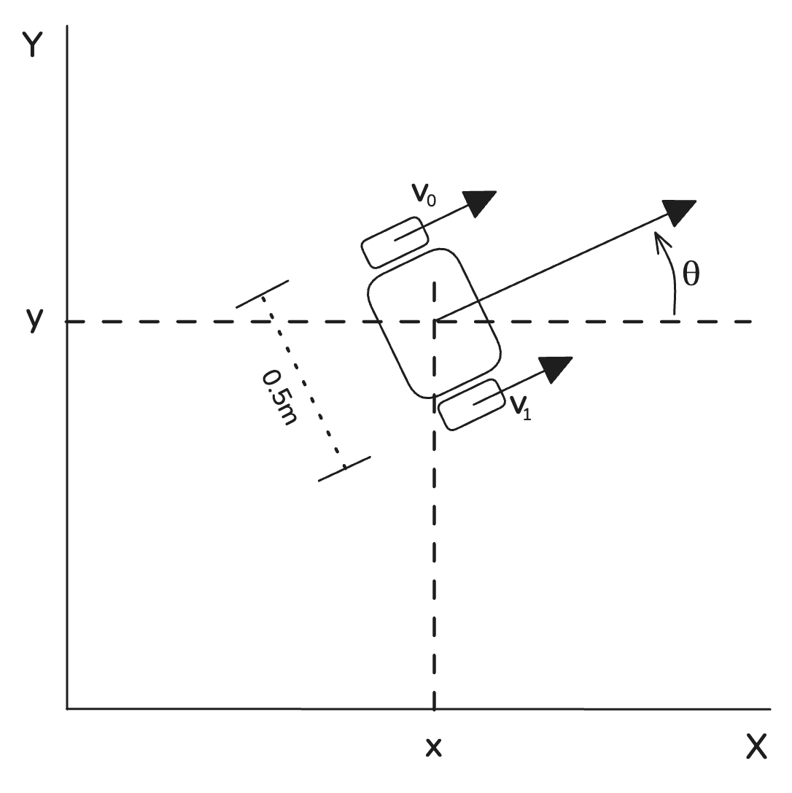
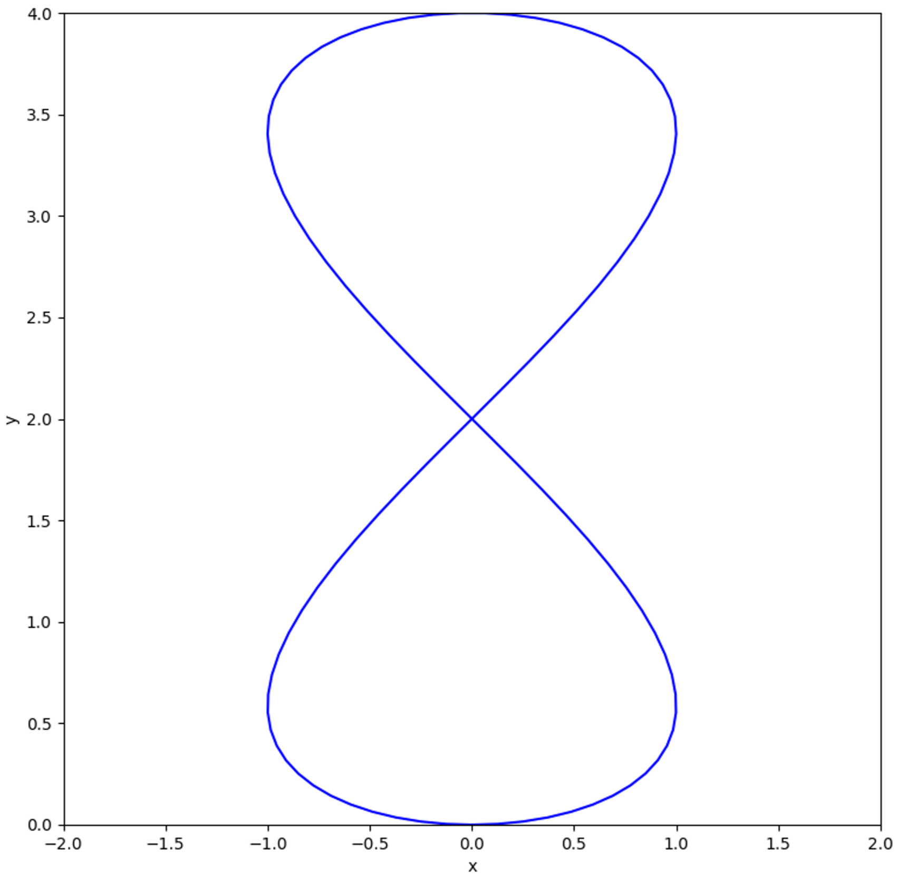

# SWE TH2: Path-following wagon

In order to move around the build site, all our systems are attached to four-wheel-drive wagons. These wagons need to localise themselves in the world and be able to drive around the site. In this assignment you’ll make a small version of our driving control systems.

### Assignment setup

To simplify the problem for this assignment, we will model our wagon as a differential wheeled robot as so:



*Diagram of the simplified wagon*

We’ve created a simple simulation of this system to which you can connect using a websocket. The server is hosted at `ws://91.99.103.188:8765` . When you connect to the server the state of the wagon is always at the origin, pointed in positive *x*.

The server will stream sensor data as JSON text messages over the websocket at ~20Hz as soon as you connect to it. All of these sensors have noise and some run at lower a lower rate. This is an example sensor data message:

```json
{
  "message_type": "sensors"
  "sensors": [
    {
      "name": "accelerometer",
      "data": [0.2606722486492453, 0.036374783270102254],
      "unit": "m/s^2",
      "timestamp": "2024-08-06T10:54:13.847166"
    },
    {
      "name": "gyro",
      "data": [0.08016226454567497],
      "unit": "rad/s",
      "timestamp": "2024-08-06T10:54:13.847166"
    },
    {
      "name": "gps",
      "data": [0.004946367154895869, -0.0030927586507839993],
      "unit": "m",
      "timestamp": "2024-08-06T10:54:13.372485"
    }
  ]
}
```

The IMU sends a local x- and y-axis acceleration and a z-axis rotational velocity, and is mounted perfectly with the x-axis in the direction of driving. The GPS will send a position relative to the origin.

You can set commands to the server by sending a message in the following format:

```json
{
   "v_left": 0.0,
   "v_right": 0.0
}
```

Here, the first and second setpoint index will control the left and right wheel ground speed of the wagon in m/s, respectively.  The speed for each wheel is limited to be in [-2.0, 2.0] and the acceleration is limited to [-1.0, 1.0]. The actuators may not be perfect.

### Goal

Your task is to make the wagon follow a path as closely as possible. The path is a variant of the [Lemniscate of Gerono](https://en.wikipedia.org/wiki/Lemniscate_of_Gerono) ****parametrised as follows:

$$
\begin{split}
x = & -2\sin k \cos k \\
y = &  \quad \: 2(\sin k + 1)
\end{split}
$$

where:

$$

k =
\begin{cases}
    \frac{\pi *t}{10} - \frac{1}{2}\pi,& \text{if } t < 20\\
    \frac{3}{2}\pi,& \text{otherwise}
\end{cases}

$$

with *t* the current time in seconds **from the first time an action setpoint was received**.

The server will track the L2 distance to the path from the real position of the wagon. At *t = 20* server will return a message with the average L2 distance to the target position to the path. Your goal is to stay as close as possible to the target.



*The goal path*

### Outcome

We expect you to work a couple of hours on this assignment. Prioritise building something that works end-to-end over optimising a single component of your solution.

You are expected to deliver:

- Code that streams setpoints to the server that allows the wagon to follow the path. You can use any language you like but please make sure it is easy to run and the code is understandable.
- Some form of visualisation of what your solutions thinks the state of the wagon is and what actions it will take. Please make sure this is intuitive to understand for us.
- A short write-up of your approach, explaining the components of your solution and any trade-offs you’ve made (<1 page). What would you change if you had a couple more days to work in this? Is your current solution general enough to follow to any path? If not, how would you change it to work in a more general case?
